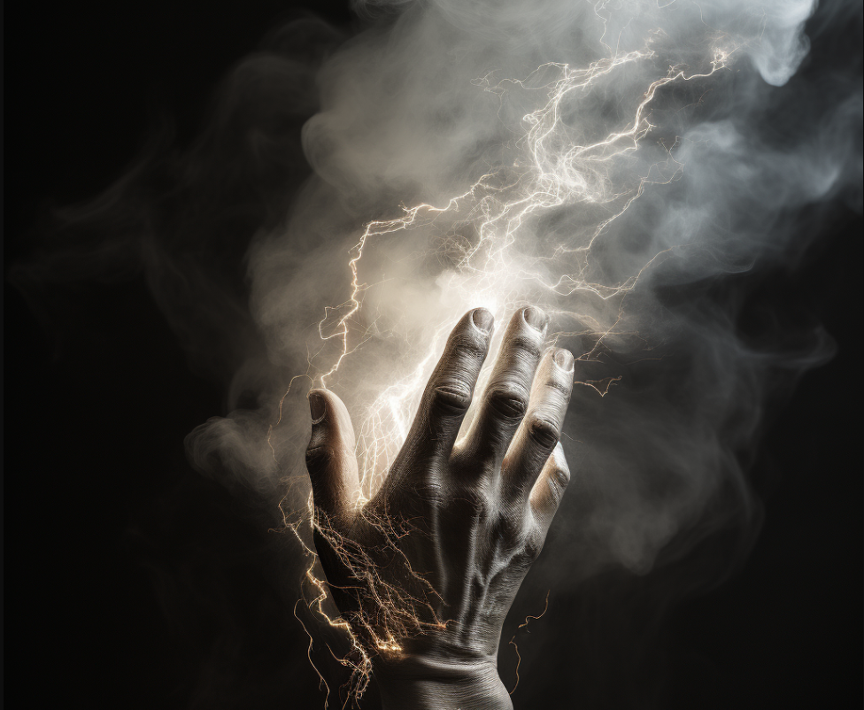

# Stormcraft

Stormcraft users can narratively attempt the following:

- Create storms.
- Manipulate storms.
- Control the weather

#### Fellweave Combination: Stormcraft

This Fellweave can only be accessed by users with a specialization in Galecraft, Hydrocraft, and Electrocraft. The lowest dice total of the required Fellweave will be used for this Fellweave.

#### Specialization: The Storm Dragon

Every storm on Terra is said to be started by a Storm Dragon, who dwells deep in the eye of the Great Storm at the edge of the world, far away from the continent of Terra.

##### Control Weather

Like the Dragons of the Great Storm, Stormcraft users may manipulate the weather to their liking. How large and furious the weather event determines the check required. A check to increase the ferocity of a storm already in progress should be far easier than if the user tried to do the same with a calm day.

Though if the legend is true and the storms do come from the Great Storm, then it would be wise for one to influence the storms wisely. As surely dragons do not tolerate the interferences of mere mortals.
