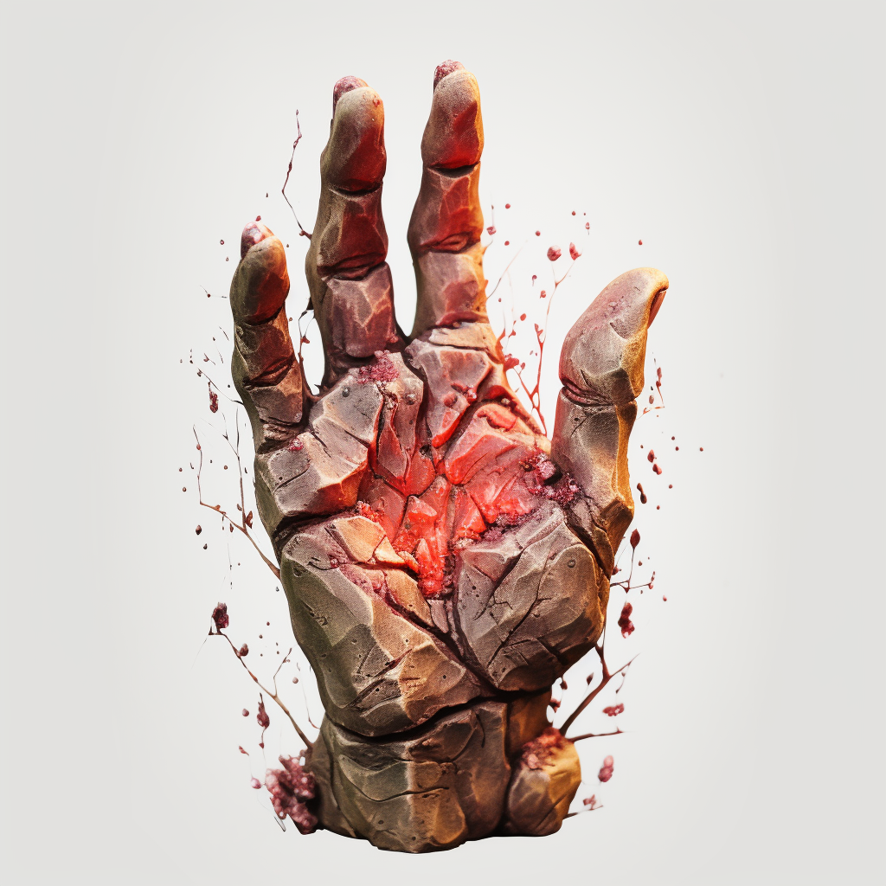

# Terracraft

Terracraft users can narratively attempt the following:

- Create and manipulate earth (earth, sand, etc...)
- Earth Sense (Vibrations) to assist Perception Checks

#### Specialization: The Terra Dragon

Dragonterra is legendary in its destructive capabilities. Dragons channel their from the elemental scales that cover their bodies.

##### Dragonterra

Allows the user to spew dragonterra from their mouth. Dragonterra is a gray substance with the consistency of wet concrete. This substance dries to form a super hard material. The user can use Terracraft to form it and quickly dry it into whatever form they desire. This ability allows Terra Dragons to build elaborate and nearly impenetrable nests.

#### Absorb Fellblood: Terra

Terra can be used to absorb Fellblood. This can be done near exposed earth, rock, geological marvels, etc...

#### Slash, Hew, and Pierce Resistance

By achieving a CL 3 check, for the cost of 1 Fellblood a character may gain resistance to this element equal to the points invested in this Fellweave. This effect has a duration of 1 hour.
