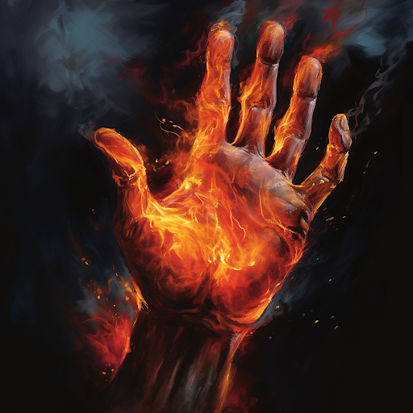
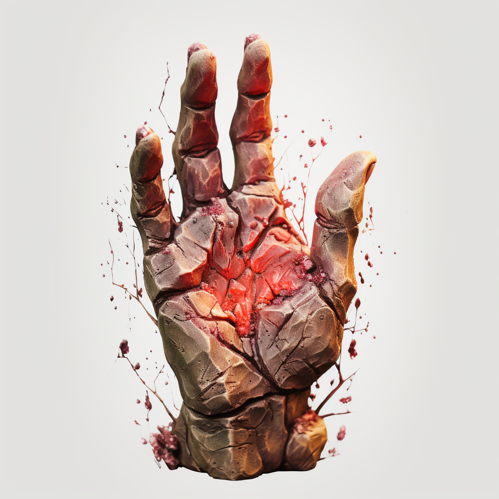
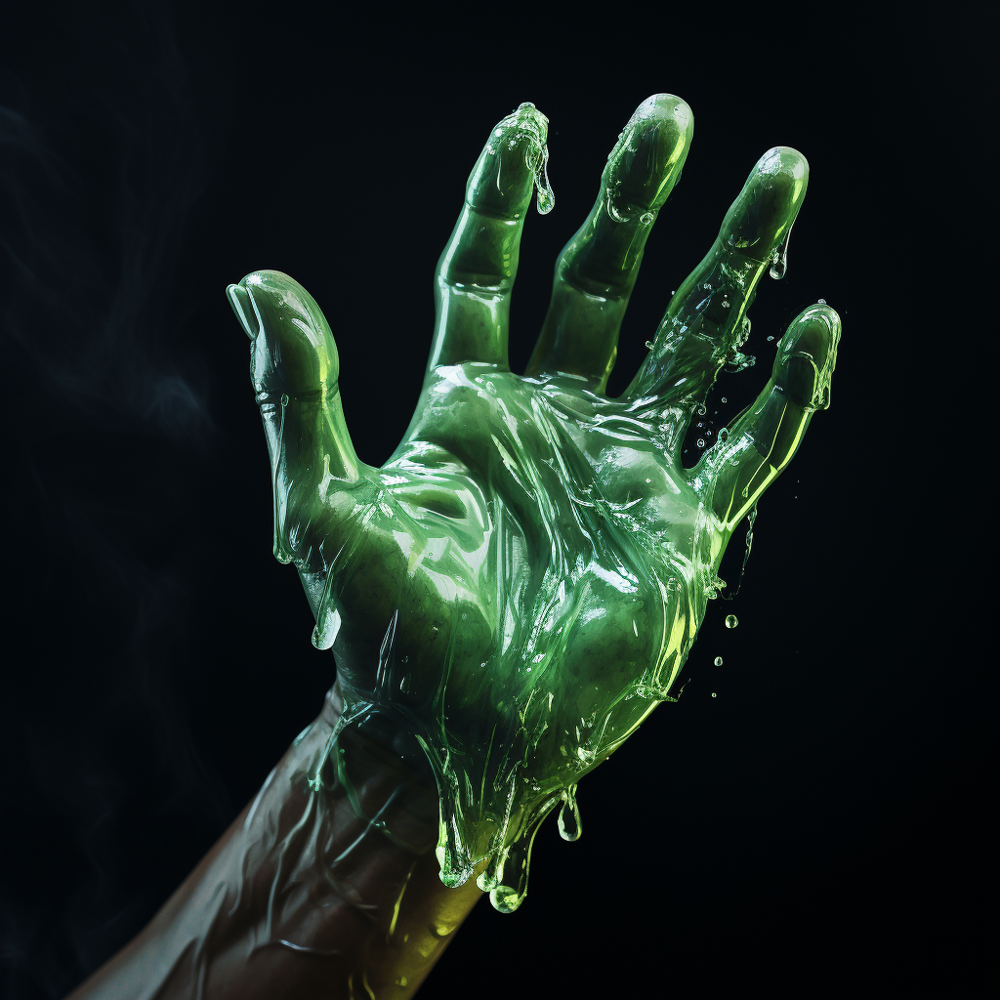

# Fellcraft

The monsters of Terra are known for their terrifying speed, strength, and elemental abilities. Their bodies achieve these abilities by using the potential energy found in their blood, referred to as Fellblood.

Due to their monstrous ancestry, Fellkind carries Fellblood, the potential energy found monster blood in their veins as well. All of Fellcraft derives it's power from Fellblood. Fellkin are able to express their dormant genes, mimicking the terrifying genetic abilities of their monstrous ancestors. These abilities can often entail rather grotesque restructuring of the user's physiology. Fellcraft takes training, practice, and study to master, leading most Fellkin never follow the path of mastering Fellcraft.

- Magic Name: Fellcraft
- Magic Vocation Name: Fellcaster
- Magic Vocation Governing Attributes: STR, RFX, INT
- Magic Resource Name: Fellblood (A character loses equivalent Fellblood to the level of injury dealt by bleed Damage)
- Cantrip Name: Trick
- Governing Core Skill: Endurance

## Silverburn

A reaction caused by silver coming into contact with Fellblood. Has various effects depending on the monster or Fellkin in question. Monsters/Fellkin will both suffer an extreme allergic reaction, often combusting the Fellblood in their blood. Silver wounds can't be healed via Hemacraft or Polycraft.

If a character has at least a level 1 in the "Fellkin" or equivalent vocation, they gain a Minor weakness to silver damage.

Silverburn damage taken while transformed by Fellblood, forces the user to make an Endurance check to maintain their form.

* CL of  Endurance check will be level of injury dealt + 1.
* If the user fails, then they lose all active Fellcraft buffs.
* For monsters this often means reducing their base attributes like STR and RFX.

## Fellcraft Tree

The only way for Fellkin to obtain new Fellcraft is to emulate the genetic links of the Monsters they originate from.

This tree represents the different path to acquire different Fellcrafts. Each solid line represents a monster whose genes bridge between Fellcrafts. For instance, Vampires represent the links between Hemacraft and Mindcraft as well as Mindcraft and Shadowcraft. While Vampires represent this on the Fellcraft Tree, these genes may exist in other monsters. This tree just shows the natural progression a Fellkin could take to acquire new Fellcraft.

Squares representing non-combination Fellcrafts. These can be accessed if you choose this if your race has access or if you have a neighboring Fellcraft square already at level 0 in that Fellcraft skill. Any newly gained Fellcraft starts at level -1.

Circles represent Fellcraft combinations, which require the Fellcrafts that attach to it in order to use. The level of the combo Fellcraft is equal to the lowest dice roll of the Fellcrafts required.

## Fellcraft List

- [Polycraft](Polycraft/Polycraft.md)
- [Blazecraft](Blazecraft/Blazecraft.md)
- [Hydrocraft](Hydrocraft/Hydrocraft.md)
- [Electrocraft](Electrocraft/Electrocraft.md)
- [Terracraft](Terracraft/Terracraft.md)
- [Galecraft](Galecraft/Galecraft.md)
- [Cryocraft](Cryocraft/Cryocraft.md)
- [Naturecraft](Naturecraft/Naturecraft.md)
- [Toxincraft](Toxincraft/Toxincraft.md)
- [Soulcraft](Soulcraft/Soulcraft.md)
- [Shadowcraft](Shadowcraft/Shadowcraft.md)
- [Mindcraft](Mindcraft/Mindcraft.md)
- [Ferracraft](Ferracraft/Ferracraft.md)
- [Sonocraft](Sonocraft/Sonocraft.md)
- [Hemacraft](Hemacraft/Hemacraft.md)
- [Spidercraft](Spidercraft/Spidercraft.md)
- [Plasmacraft](Plasmacraft/Plasmacraft.md)
- [Stormcraft](Stormcraft/Stormcraft.md)
- [Magmacraft](Magmacraft/Magmacraft.md)
- [Blizzardcraft](Blizzardcraft/Blizzardcraft.md)

## Blazecraft

Blazecraft users can narratively attempt the following:

- Create, manipulate, and extinguish fire, smoke, and ash.
- Resist fire and heat.
- Raise core body heat to resist disease and hypothermia.

Blazecraft is one of the most common Fellcraft learned, owing to its utility and combat effectiveness. It allows the user to create and manipulate fire. While all expressions of Blazecraft come from the same root gene, the most widely taught and used is derived from the Phoenix immolation or Dragonfire.

### Specialization: The Fire Dragon

Dragonfire is legendary in its destructive capabilities. Dragons channel their from the elemental scales that cover their bodies.

Allows the user to breathe fire from their mouth. In addition, the fire the user produces has an odd dark coloring to it. This fire has a mind of its own, leaping from fuel to fuel. The raw destructive power is terrifying, as given the right circumstance things can quickly go out of hand.

### [Unfinished] Specialization: The Phoenix

Phoenix produce fire via the  immolation of one's own flesh as fuel for the fire, a process similar to the Silverburn reaction. Phoenix solved this issue by evolving ways to channel magic into regenerating flesh as fast as they burn it. This produces an immense amount of heat and flame, though it is quite taxing on the user. That being said this isn't a safe process, and can end up backfiring on new users of this Fellcraft.

### Absorbing Fellblood: Fire

Fire and heat can be used to absorb Fellblood. This can be done with large fires, volcanoes, smoldering ash, blazing comets, etc...

## Cryocraft

Cryocraft users can narratively attempt the following:

- Create cold (ice)
- Manipulate cold

### Specialization: The Ice Dragon

Dragonfrost is legendary in its destructive capabilities. Dragons channel their from the elemental scales that cover their bodies.

Allows the user to breathe dragonfrost from their mouth. In addition, the frost the user produces has an odd dark coloring to it. This frost has a mind of its own, leaching of everything around it through a form of entropy. The raw destructive power is terrifying, as given the right circumstance things can quickly go out of hand.

### Absorb Fellblood: Cold

Cold can be used to absorb Fellblood. This can be done with blizzards, frigid environments, and large bodies of ice.

## Electrocraft

Electrocraft craft users can narratively attempt the following:

- Create and manipulate electricity.
- Resist electric damage.
- Use Electrosense (Assist on Perception)

Practitioners of Electrocraft are actually generating electrite, a naturally occurring crystal that has many electrical properties used across Terra in various runecraft inventions. Naturally occurring electrite can be found underground, glowing if it holds a charge. A user's body can use these crystals to convert the Fellblood in one's blood into an electric charge held within the electrite on the user's body. This charge can then be released by the user at will.
A favorite among users of Runecraft, Electrocraft can aid in constructing Runecrafts owing to its ability to charge and influence electrite. The most common forms of Electrocraft are derived from Storm Dragons and Thunderbirds. Those of Darkbeast heritage grow specialized hair imbued with electrite, though this form has mainly been lost throughout the bloodlines.

### Specialization: The Lightning Dragon

Dragonlightning is legendary in its destructive capabilities. Dragons channel their from the elemental scales that cover their bodies.

Allows the user to breath dragonlightning from from their mouth. In addition, the lightning the user produces has an odd dark coloring to it. This lightning has a mind of its own, leaping on its own volition. The raw destructive power is terrifying, as given the right circumstance things can quickly go out of hand.

### Absorb Fellblood: Electricity

Electricity can be used to absorb Fellblood. This can be done with lighting storms, electrite containing electricity, etc...

## Ferracraft

Ferracraft users can narratively attempt the following:

- Create and manipulate metals using magnetic waves
- Metal Sense (Vibrations) to assist Perception Checks

### Specialization: The Metal Dragon

Dragonsteel has legendary properties of strength and durability. Dragons channel their power from the dragonsteel scales that cover their bodies.

Allows the user to produce dragonsteel from their bodies. In addition, the plant growth the user produces has an odd dark coloring to it. This plant growth has a mind of its own, spreading to everything around it. The raw destructive power is terrifying, as given the right circumstance things can quickly go out of hand.

### Absorb Fellblood: Magnetism

Large amounts of magnetic waves can be used to absorb Fellblood. This can be done with near sources of large magnetic energy.

## Galecraft

Galecraft craft users can narratively attempt the following:

- Create gales and fog.
- Manipulate gales.
- Attempt to high jump
- Attempt to levitate
- Attempt to fly
- Compress air to create shortwaves

Galecraft generally takes on two forms, derived from the great monstrous birds and Gale Dragons. Those that draw their Galecraft from the great birds such as Phoenix or Thunderbird will grow feathers that can be used to influence the gales, some of these feathers will detach, still under the user's influence. These feathers can act as extensions of the user’s will far from their bodies.

### Specialization: The Gale Dragon

Dragongale is legendary in its destructive capabilities. Dragons channel their from the elemental scales that cover their bodies.

Allows the user to breath dragongale from from their mouth. In addition, the dragongale the user produces has an odd smokey coloring to it. Dragongale has a mind of its own, creating small tornadoes. The raw destructive power is terrifying, as given the right circumstance things can quickly go out of hand.

### Absorb Fellblood: Gale

Gale can be used to absorb Fellblood. This can be done near storms, tornadoes, places of great height, ect...

## Hemacraft

Hemacraft users can narratively attempt the following:

- Create and manipulate blood
- Absorb Fellblood from living hosts
- Blood Sense (Heartbeats) to assist Perception Checks

### Specialization: The Healing Blood

This technique was discovered when Byrgenwerth Scholars found a dark truth deep within the Siren ruins that now lay under Reddwall. Protected fervently by House Reddington and the scholars at Byrgenwerth. Healing blood is shelf stable, has antifungal and antibacterial properties.

### Absorb Fellblood: Blood

Blood can be consumed to absorb Fellblood. Every time a Hemacraft attack is successfully made, you may regain 1 Fellblood.  An extra point of Fellblood should be awarded if a Fellkind of Monster blood is consumed. The opponent loses 1 Fellblood.

## Hydrocraft

Hydrocraft users can narratively attempt the following:

- Create water.
- Absorb water into the body.
- Manipulate water (could also affect tea, milk, coffee, etc).
- Resistance water pressure and cold water.
- Water breathing
- Deep Sense (Assist for Perception checks)

### Specialization: The Kraken

The way of the Kraken involves using a form of jet propulsion, sucking water into squid-like growths on the body and propelling outward. One of the most popular forms of Hydromancy is to create a water tentacle from yourself. These can assist in movement, defense, or offense.

The most common form of Hydrocraft is derived from the Kraken. The way of the Kraken involves using a form of jet propulsion, sucking water into squid-like growths on the body and propelling outward.

### Specialization: The Sea Serpent

Dragontide is legendary in its destructive capabilities. Dragons channel their from the elemental scales that cover their bodies.

Allows the user to breath dragontide from from their mouth. Dragontide the user produces has an odd dark coloring to it. Dragontide has a mind of its own, leaping from thrashing and drowning anything around it. The raw destructive power is terrifying, as given the right circumstance things can quickly go out of hand.

### Absorbing Fellblood: Water

Water can be used to absorb Fellblood. This can be done by submerging oneself in water or meditating near a large body of water.

## Mindcraft

Mindcraft users can narratively attempt the following:

- Telepathy

Common among dhampirs, Mindcraft is the ability to connect to, influence, or dominate others minds. There are multiple expression of this ability. The most eyes flash using use Mindcraft, generally green.

### Specialization: Dreamcraft

Dreamcraft users can narratively attempt the following:

- Manipulate and invade dreams

The existence of Dreamcraft is debated among academics and has been relegated to the superstition of old wives tales. The rare few on Terra that have learned this craft have the ability to invade the dreams of sleeping individuals. There they can search through and manipulate the subconscious of the individual. This can be extremely dangerous though, even with an individual one would perceive as weak externally might be harboring something truly dangerous within. Many are driven mad, as they become unable to distinguish reality and the dream.

### Absorb Fellblood: Thought

Thoughts can be used to absorb Fellblood. The victim must not be resisting. This can be done with Fellkin, Brightkin, animals, monsters, etc... Extra points should be awarded for Fellkin and Brightkin. Extra points should be awarded if used on a victim's dreams.

## Naturecraft

Naturecraft users can narratively attempt the following:

- Create plants
- Manipulate plants
- Plant Sense (Vibrations) to assist Perception Checks

### Specialization: The Nature Dragon

Dragongrowth is legendary in its destructive capabilities. Dragons channel their power from the elemental scales that cover their bodies.

Allows the user to dragongrowth from their mouth. In addition, the plant growth the user produces has an odd dark coloring to it. This plant growth has a mind of its own, spreading to everything around it. The raw destructive power is terrifying, as given the right circumstance things can quickly go out of hand.

### Absorb Fellblood: Nature

Large amounts of plant life can be used to absorb Fellblood. This can be done with forests, crop fields, or large gardens.

## Polycraft

Polycraft users can narratively attempt the following:

- Take on physical monstrous traits
- Attack with monstrous traits
- Modify appearance

Polycraft fundamentally is the ability to enhance, heal, and change one's body. The various races have their own variant of this, leading to unique abilities between them.

### Specialization: The Beast

The many monsters of the Continent such as werebeasts, vampires, kikimora, etc... are known for their remarkable strength, speed, and durability. Those that follow this specialization seek to emulate these features in their own bodies.

### Specialization: The Doppelganger

Doppelgangers are devious shapeshifters that take on the appearance of other humanoids, throwing off pursuit or luring victims to their doom with misdirection and disguise. Common practitioners of this are spies, assassins, thiefs, etc… The narrator may give dice bonuses based on the context of the mimicked persona in relation to the creature the user is trying to influence.

### Absorbing Fellblood: Flesh and Blood

Flesh and blood can be consumed to regain Fellblood. This generally is done ravenously. An extra point of Fellblood should be awarded if a Fellkind of Monster is consumed.

## Shadowcraft

Shadowcraft users can narratively attempt the following:

- Create and manipulate shadow
- Shadowleap
- Improve your stealth

### Shadow Leaping

Shadow Leaping is a form of short range teleportation. The user must have access to a large shadow near them that is not their own shadow. They can use it as a door to a neighboring shadow, rematerialized there.

### Specialization: The Shadow Dragon

Dragonumbra is legendary in its destructive capabilities. Dragons channel their from the elemental scales that cover their bodies.

Allows the user to breath dragonumbra from their mouth. Dragonumbra encroaches on all light sources around it, fading them out. Darksight does not work in dragonumbra. Entities will attack and abduct anyone in the darkness. This dragonumbra has a mind of its own. The raw destructive power is terrifying, as given the right circumstance things can quickly go out of hand.

### Absorb Fellblood: Shadow

Shadow can be used to absorb Fellblood. This can be done in pitch black environments.

## Sonocraft

Sonocraft users can narratively attempt the following:

- Emit sound and concussion waves
- Manipulate sound
- Silence sounds
- Mimic voices and observed sounds
- Echolocation to assist Perception Checks

### Specialization: The Dragon

### Absorb Fellblood: Sonic Sounds

Large sonic cracks can be absorbed to regain Fellblood. This can be done with explosions, objects breaking the sound barrier, etc...

## Soulcraft

Soulcraft users can narratively attempt the following:

- Forge souls (Non-conscious souls)
- Manipulate/bind souls
- Animate bodies (organic and non-organic)
- Communicate with Lost Souls
- Feed on souls
- Resit spiritual attacks
- Astral projection and interaction
- Astral Sense (Assist for Perception checks)
- Phase though material objects (non-silver or Runecraft)
- Posses

Users of Soulcraft learn to consciously control and strengthen their own soul. This allows them to communicate, bend, dominate, and even feed the souls of the Lost and the living. Users learn how to cross the barrier of the material plane into the astral plane.

Depending on the morality and spiritual strength of an individual, their personal spiritual projections appearance will change. Soulcraft users can also see the souls of the living. Generally a bright soul means a person is moral/ethical. Whereas, generally someone with a dark soul that pulls in all the light around them means a person is immoral/unethical. It should be noted that this is only based on how the individual perceives their own actions. A tyrant that fully believes in his cause could have a soul as bright as a saint.

### Specialization: The Wraith

When an individual dies without descendants, their soul wanders aimlessly on the material plane. These ghosts of Fellkind are preyed upon Wraith, monsters that have learned to interact and feed on the lost souls of the continent. Wraiths tend to lurk in places of death. They will not leave their dwellings to hunt for the living. Though, if an unfortunate soul wanders within, the wraith will of course consume the soul of their victim.

### Specialization: The Undead Dragon

Soulfire is legendary in its destructive capabilities. Soul fire produces cold and is fueled by soul/life energy. It has a greenish/purple appearance and flickers much more slowly than regular fire. Undead Dragons channel this from the elemental scales that cover their bodies.

Allows the user to breathe soulfire from their mouth. This energy has a mind of its own, leaping from soul to soul. The raw destructive power is terrifying, as given the right circumstance things can quickly go out of hand.

### Absorb Fellblood: Souls

Souls can be absorbed and feed on to regain Fellblood. Victim can not resist. An extra point of Fellblood should be awarded if a Fellkin or Brightkin is consumed.

## Spidercraft

Spidercraft users can narratively attempt the following:

- Produce webbing of various strength and adhesiveness
- Manipulate webbing
- Stick to surfaces like a spider (Assist with Spider Craft for Climb Checks)

Webs cannot inflict damage. Instead follow the table below.

| Name                            | Effect                                                                               |
| ------------------------------- | ------------------------------------------------------------------------------------ |
| Minor Binding (Lvl 1 Victory)   | -1d6 to physical skills (RFX/STR), -1d6 to Combat (RFX/STR), -¼ of combat movement  |
| Medium Binding (Lvl 2 Victory)  | -1d6 to physical skills (RFX/STR), -1d6 to Combat (RFX/STR), -2/4 of combat movement |
| Serious Binding (Lvl 3 Victory) | -1d6 to physical skills (RFX/STR), -1d6 to Combat (RFX/STR), -3/4 of combat movement |
| Supreme Binding (Lvl 4 Victory) | Target is incapacitated within the binding                                           |
| Fatal Binding (Lvl 5 Victory)   | Target is incapacitated withing binding and begins to suffocate.                     |

### Fellcraft Combination

This Fellcraft can only be accessed by users with a specialization in Polycraft and Toxicant. The lowest dice total of the required Fellcraft will be used for this Fellcraft.

### Specialization: The Giant Spider

### Absorb Fellblood: Liquify Prey

Prey can be absorbed to regain Fellblood. This can be done by mummifying the prey and injecting a digestive toxin. After some time, the digested prey can be drunk from, resulting in an extra +1 Fellblood. Also gain an additional +1 Fellblood if the prey is a monster or Fellkin...

### Spider Climb

By achieving a CL 3 check, for the cost of 1 Fellblood a character may gain the ability to stick to walls like a spider. The user gains automatic wins to climb checks equal to their Spidercraft skill.  This effect has a duration of 1 hour.

## Terracraft

Terracraft users can narratively attempt the following:

- Create and manipulate earth (earth, sand, etc...)
- Earth Sense (Vibrations) to assist Perception Checks

### Specialization: The Terra Dragon

Dragonterra is legendary in its destructive capabilities. Dragons channel their from the elemental scales that cover their bodies.

Allows the user to spew dragonterra from their mouth. Dragonterra is a gray substance with the consistency of wet concrete. This substance dries to form a super hard material. The user can use Terracraft to form it and quickly dry it into whatever form they desire. This ability allows Terra Dragons to build elaborate and nearly impenetrable nests.

### Absorb Fellblood: Terra

Terra can be used to absorb Fellblood. This can be done near exposed earth, rock, geological marvels, etc...

## Toxincraft

Toxincraft users can narratively attempt the following:

- Create toxins, venoms, poisons, acid, antivenom, etc...
- Manipulate toxins, venoms, poisons, acid, antivenom, etc...
- (Heartbeats) to assist Perception Checks

### Specialization: Dragonvenom

Dragon Venom is legendary in its destructive capabilities. Dragons channel from the elemental scales that cover their bodies. Any affected by the powerful neurotoxin are instantly paralyzed.

Dragon venom never degrades or dries out. It is tasteless and odorless, making it a preferred tool of assassins. Common antivenom have zero effect on it. A person affected with the venom has visible black veins visible through their skin as the necrotic effects kill from within.

### Absorb Fellblood: Toxins

Toxins can be used to absorb Fellblood. If the toxin is already within the user, they may absorb it.
