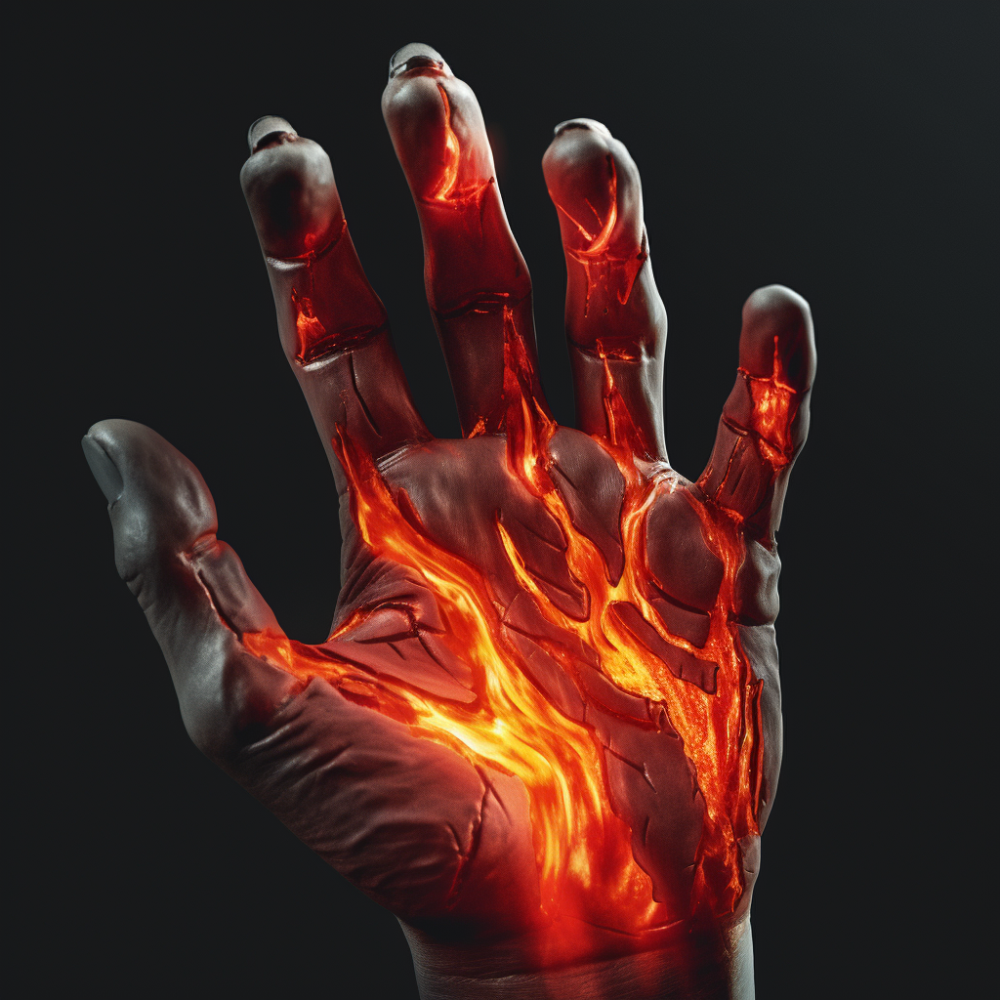

# Magmacraft

Magmacraft users can narratively attempt the following:

- Create magma.
- Manipulate magma.
- Melt rock.
- Influence tectonic plates

#### Fellcraft Combination: Magmacraft

This Fellcraft can only be accessed by users with a specialization in Blazecraft and Terracraft. The lowest dice total of the required Fellcraft will be used for this Fellcraft.

#### Specialization: The Magma Dragon

When the horrors of Terra bowed down before the Bright Lord, the Bright Lord conscripted the Great magma dragons of the world who dwell even deeper than the great underground caverns of Terra in infinite seas of lava. The continents that were once separate were brought together, so that Brightkind may rule over all of their new world.

##### Influence Tectonic Plates

The influence of tectonic plates can result in magma geysers and other geological phenomena. If enough masters of Magmacraft were brought together, Terra itself might shift once again…
