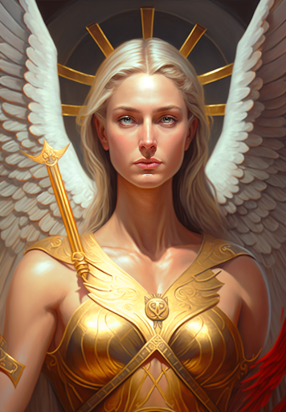

# Brightkin

When the Bright Lord bestowed his divine gift upon the first loyal women of Fellkind, their offspring became Brightkin, also known as Demibrights, in the realm of Terra. Regardless of their chosen partners, Brightkin always produce offspring who bear the radiant essence of their lineage. However, the birth of Brightkin children is a rare occurrence, as infertility plagues their people, often requiring couples to wait hundreds of years before conceiving a child.

## Distinctive Physical Features

Brightkin are a resplendent and alluring, with the concept of an unattractive Brightkin being entirely unheard of.

## Culture

The Dawn Empire is under the rule of the Imperial family, composed entirely of Brightkin. Their capital city, Crossroads, standing at the heart of the continent. From there, they exercise dominion over the entire continent. While the Legions of Empire wield formidable might, a specialized branch known as "The Inquisition" acts as the Empire's fist, crushing rebellion, the outbreaks of disease, and heretics. Renowned for their intellectual prowess, Brightkin produce some of the finest scholars and keepers of lore on Terra.

Devout followers of the Bright Lord and his pantheon, the Brightkin exhibit fervent worship. Many young Brightkin embark on pilgrimages across Terra, spreading the teachings and message of the radiant deity.

## Language

- Bright-speak
- Babelish

## Life Span

Indefinite

## Magic Predispositions

- Radiance
- Blessings

One of the remarkable abilities bestowed upon the Brightkin is their capacity to wield the power of the Bright Lord, known as Miracles. Miracles can creates miracles that transcend the boundaries of natural laws, considering them mere suggestions. To perform Miracles, a Brightkin channels the power of Ichor through intense emotions or vivid memories, harnessing them to achieve their desired effects. Mastery of Miracles necessitates training and practice in the art of emotional control. While not all Brightkin dedicate themselves to mastering Miracles, they all enjoy the benefits of near-immortality. Following their unnatural demise, as long as a Brightkin possesses an internal reserve of light or their lifeless body is exposed to the rejuvenating rays of sunlight, they will gradually resurrect, basked in a resplendent glow. This process restores their body to its peak condition, healing all wounds.
