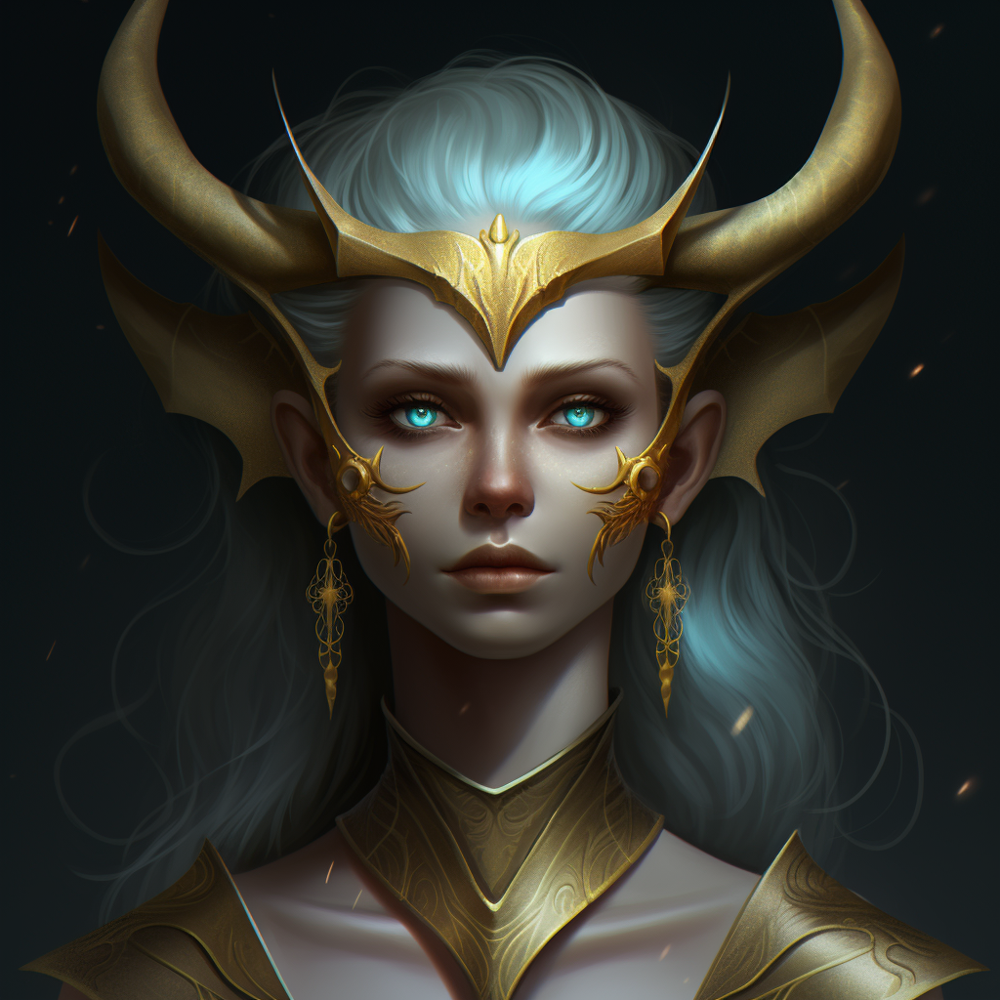
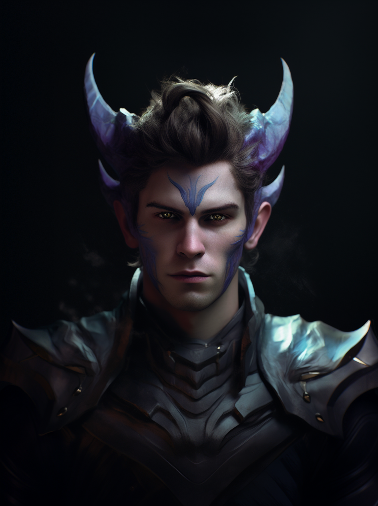

# Dragonkin

Dragonkin trace their monstrous ancestry from the ancient dragons that bowed to the Bright lord. These monsters were grafted consciousness and the form of the Bright Lord.

## Distinctive Physical Features

- Horns
- Scaly sections of their skin
- Pointed ears

## Culture

Dragonkin are one of the rarest races on Terra, as very few of the ancient dragons bowed to the Bright Lord during the Awakening. Dragons are a proud species and dragonkin seemed to have inherited this trait from their monstrous ancestors.

While there is significant archeological evidence of a ancient enormous Dragonkin empire during the Twilight Age, sadly no written accounts of them remain, lost to the annals of time.

Due to their modern low population, there is no dragonkin majority country. Instead, they occupy positions of authority in many countries across Terra. They make fine advisors and scholars as their long lives permit the ability to learn thousands of years worth of information.

Many Dragonkin worship the Great Leviathan, as it is said that all dragons came from it. For in a time before the creation of Terra, the Great Leviathan aided the Bright Lord. And thus the Bright Lord bestows wings upon all his descendants.

## Language

- Draconic
- Babelish

## Life Span

- Indefinite (Unless scales are removed)

Dragonkin, much like Brightkin, appear to have an indefinite lifespan. This appears to be related to the scales across their bodies as upon their removal they begin to age and eventually perish.

## Fellcraft Predispositions

- Sonocraft
- Polycraft

Dependent on their draconic ancestor.

- Red Dragon: Blazecraft
- Green Dragon: Toxincraft
- Sea Dragon: Hydrocraft
- Undead Dragon: Soulcraft
- Storm Dragon: Galecraft, Electrocraft
- Nature Dragon: Naturecraft
- (Make your own!)
