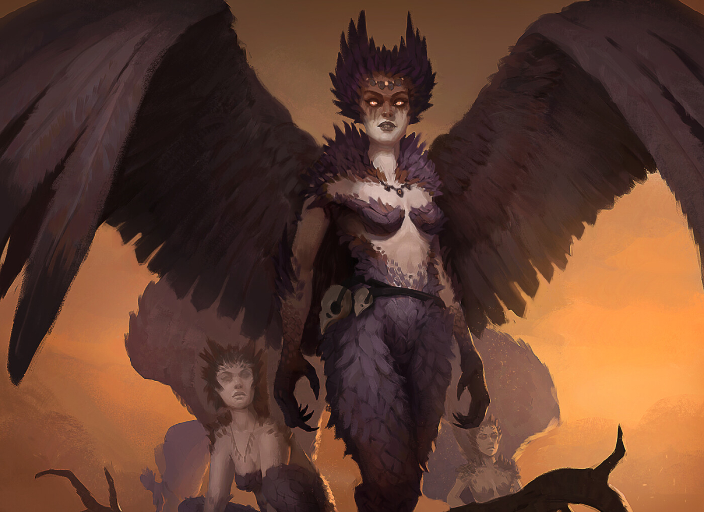

# Harpy

Harpies trace their monstrous ancestry from the ancient avian monsters that bowed to the Bright Lord. These monsters were grafted consciousness and the form of the Bright Lord.

## Culture

Know as a generally a nomadic warlike people, Harpies rarely found among the terrestrial races of Terra or as the Harpies call them, "low landers". Traveler's may encounter Harpies while explore biomes of great verticality such as The Spine of the World or the numerous floating islands that dot the sky of Terra.

From an early age, Harpies begin mastering the use of Galecraft, as flight is a core being and necessary for survival.

## Distinctive Physical Features

- Bird like eyes
- Feather-like hair
- Feather protruding from various places on their bodies
- Bird like feet
- Bird talon like hands

## Fellcraft Predispositions

- Galecraft
- Polycraft
- Cryocraft
- Stormcraft
- Electrocraft

## Language

- Sky-tongue
- Babelish

## Life Span

150 - 200 years
