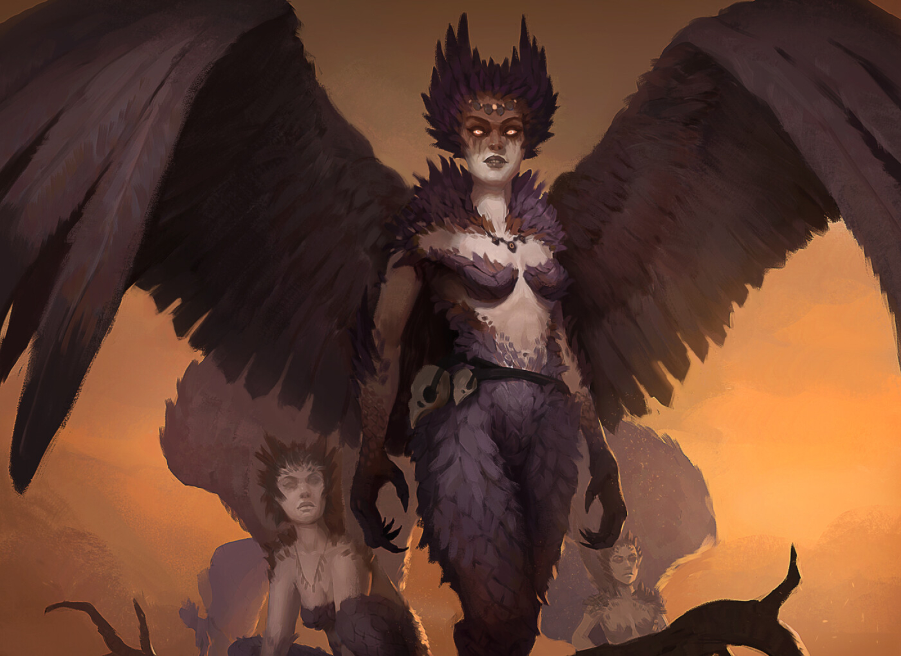

# Races

#### Pre-made Fellkin Races:

- [Beastkin](Beastkin/Beastkin.md)
- [Chitinkin](Chitinkin/Chitinkin.md)
- [Crossbreed](Crossbreed/Crossbreed.md)
- [Dhampir](Dhampir/Dhampir.md)
- [Dragonkin](Dragonkin/Dragonkin.md)
- [Harpy](Harpy/Haryp.md)
- [Seakin](Seakin/Seakin.md)

#### More Fellkin Race Ideas:

- Ogrekin
- Wraithkin
- Griffinkin
- Serpentskin
- Spiderkin
- Leshenkin
- Slimekin
- Impkin

## Fellkin

Fellkin trace their ancestry to the monster the bowed before the Bright Lord during the Awakening.

Fellkin vary wildly, but all share the innate risk of going feral. This occurs when a continuously Fellkin feeds on another Fellkin, resulting in madness and increased monstrous traits. While this can be a temporary affliction in mild cases, many never recover....

### Beastkin

Beastkin or Lycans trace their monstrous ancestry from Werewolves and other Bestial monsters that bowed to the Bright Lord.

#### Sub-Races:

- Wolfkin
- Felinekin
- Foxkin
- Molekin
- Yetikin
- Chimpkin
- Mousekin

#### Distinctive Physical Features

Since Beastkin are highly varied and shapeshifters, their appearances can vary wildly. Beastkin that live on the Isles of Crest live day to day with their bestial traits showing such as fur, claws, and bestial facial features. While in Reddland, where showing these features openly is considered a social taboo, Beastkin simply have animalistic eyes and slightly larger canines. The extent to which their Bestial feature shows is completely subconscious and has usually formed by early adolescence.

#### Culture

Beastkin exists in many countries across Terra. Leodelphia and The Isles of Crest have a majority Beastkin population.

Leodelphia is mostly inhabited by felinekin centered around the capital of Oasis which is weaved into an  ancient jungle.

The Isles of Crest are mainly inhabited by canine beastkin. They are a tribal people and weary of outsiders. The largest city named Starfall is centered around where a falling star crashed in the far past.

#### Language

- Primal
- Babelish

#### Life Span

150 - 200 years

#### Fellcraft Predispositions

- Polycraft
- Sonocraft

### Chitinkin

Chitinkin (or Kiki as they call themselves) trace their ancestry from the ancient insectoid monsters that bowed to the Bright lord. These monsters were granted consciousness and the form of the Bright Lord.

#### Distinctive Physical Features

- Exoskeleton exteriors
- Insectoid-like traits.

#### Culture

Most Chitinkin dwell deep within the earth in massive colonies that span the massive underground caverns under the surface of Terra. Their societies are heavily influenced by their biology, with their purpose and job dictated by the needs of the collective.

In each Chitinkin city dwells a queen who has powerful Mindcraft that allows her to influence the wills of the non-royal population.  The majority of the Chitinkin are workers that harvest the vast underground mushroom farms and expand the colony. Those that are born into the royal cast are resistant to the queen's influence. They serve as generals, advisors, dukes, and other jobs that require creativity and  self-will.

The largest of these Colonies in the Hive is located in Caurus. The Chitinkin that live on the outskirts of the colonies devoid of the queen’s influence live hard nomadic lives. They stay far away from the colonies as venturing to close might tempt their minds.

#### Language

- Workers: 30 - 50 years
- Royals: 300 - 500 years

#### Life Span

- Kikishi
- Babelish

#### Fellcraft Predispositions

- Polycraft
- Mindcraft
- Sonocraft
- Toxincraft
- Terracraft
- Galecraft

### Crossbreed

Crossbreeds trace their monstrous ancestry from the ancient monsters that bowed to the Bright Lord. These monsters were grafted consciousness and the form of the Bright Lord. However, due to the dilution and mixing of their ancestral bloodlines, the genetic gifts of their monstrous ancestry are lost to Crossbreeds. They are often referred to as Mudbloods due to their impure bloodlines.

Some bloodlines become impure in a single generation while others take many generations.

#### Distinctive Physical Features

Crossbreed have relatively plain features as compared to the other races of Terra. Some Crossbreed may have some subtle features of their monstrous ancestry such as slight fangs, strange eyes, or they are a little hairier than most, it is almost a sure point that their children's children will not. Once a blood line has been crossed, the result is a forgone conclusion.

#### Culture

Mudbloods make up a large percentage of the population of Terra. Due to their impure bloodline, they are often of a lower class as many of the aristocratic societies across Terra hold deep seeded prejudice against them. While some rise above the prejudice and obtain wealth, status and fame, most live as mundane farmers and peasants. The only Crossbreeds of aristocratic status were great houses where their bloodlines slowly became impure.

#### Language

- Babelish

#### Life Span

50 - 100 years

#### Fellcraft Predispositions

- None

### Dhampir

Dhampirs trace their monstrous ancestry from the Vampires that bowed to the Bright Lord. Sunlight is deadly to Vampires, meaning those that stood in front of the Bright Lord surely should have perished…

 While Vampires have a powerful aversion to sunlight, dhampirs are unaffected, hence why they are also referred to as day walkers.

#### Culture

Reddland is the largest Dhampir kingdom on the eastern edge of Terra. Reddlandians are a fiercely proud people, ruled by house Reddington. Their standing military, “The Redd Legion'' is one of the finest armies on Terra and the recent discovery of Blood Healing has made Reddland a key player in global politics.

Reddland has become a powerful political player as during the Spore pandemic that ravaged the continent, it was their healing bloods that cured the fungal plague that ravaged the continent.

#### Distinctive Physical Features

- Pointed ears
- Elongated canines
- Faintly glowing eyes

#### Language

- Pirish
- Babelish

#### Life Span:

3000 - 5000 years

#### Fellcraft Predisposition

- Hemacraft
- Polycraft
- Shadowcraft
- Mindcraft
- Sonocraft

### Dragonkin

Dragonkin trace their monstrous ancestry from the ancient dragons that bowed to the Bright lord. These monsters were grafted consciousness and the form of the Bright Lord.

#### Distinctive Physical Features

- Horns
- Scaly sections of their skin
- Pointed ears

#### Culture

Dragonkin are one of the rarest races on Terra, as very few of the ancient dragons bowed to the Bright Lord during the Awakening. Dragons are a proud species and dragonkin seemed to have inherited this trait from their monstrous ancestors.

While there is significant archeological evidence of a ancient enormous Dragonkin empire during the Twilight Age, sadly no written accounts of them remain, lost to the annals of time.

Due to their modern low population, there is no dragonkin majority country. Instead, they occupy positions of authority in many countries across Terra. They make fine advisors and scholars as their long lives permit the ability to learn thousands of years worth of information.

Many Dragonkin worship the Great Leviathan, as it is said that all dragons came from it. For in a time before the creation of Terra, the Great Leviathan aided the Bright Lord. And thus the Bright Lord bestows wings upon all his descendants.

#### Language

- Draconic
- Babelish

#### Life Span

- Indefinite (Unless scales are removed)

Dragonkin, much like Brightkin, appear to have an indefinite lifespan. This appears to be related to the scales across their bodies as upon their removal they begin to age and eventually perish.

#### Fellcraft Predispositions

- Sonocraft
- Polycraft

Dependent on their draconic ancestor.

- Red Dragon: Blazecraft
- Green Dragon: Toxincraft
- Sea Dragon: Hydrocraft
- Undead Dragon: Soulcraft
- Storm Dragon: Galecraft, Electrocraft
- Nature Dragon: Naturecraft
- (Make your own!)

### Harpy

Harpies trace their monstrous ancestry from the ancient avian monsters that bowed to the Bright Lord. These monsters were grafted consciousness and the form of the Bright Lord.

#### Culture

Know as a generally a nomadic warlike people, Harpies rarely found among the terrestrial races of Terra or as the Harpies call them, "low landers". Traveler's may encounter Harpies while explore biomes of great verticality such as The Spine of the World or the numerous floating islands that dot the sky of Terra.

From an early age, Harpies begin mastering the use of Galecraft, as flight is a core being and necessary for survival.

#### Distinctive Physical Features

- Bird like eyes
- Feather-like hair
- Feather protruding from various places on their bodies
- Bird like feet
- Bird talon like hands

#### Fellcraft Predispositions

- Galecraft
- Polycraft
- Cryocraft
- Stormcraft
- Electrocraft

#### Language

- Sky-tongue
- Babelish

#### Life Span

150 - 200 years

### Seakin

Seakin or Sirens trace their monstrous ancestry from the sea monsters that bowed to the Bright lord. These monsters were grafted consciousness and the humanoid form of the Bright Lord.

#### Distinctive Physical Features

- Fin-like ears
- Blue, green, purple skin (other colors exist)
- Distinctive natural markings

#### Culture

Much of Siren culture exists beneath the water, owing to their inherent abilities to breath the water. Siren culture used to dominate much of the eastern part of Terra under the Witch Queen Alana. After her defeat, Siren culture retreated for the most part back to the seas. The largest land-based settlement, Tentcity, lies in the south of what is now modern day Reddland, ruled by House Roseblood.

Sirens worship different gods than the pantheon of the Brights, though they share a god in the Twisting One which they refer to as “The Leviathan”. A prominent deity worshiped is the Moon Presences, the Parent and the Child.

#### Language

- Deep-speak
- Babelish

#### Life Span

150 - 200 years

#### Fellcraft Predispositions

- Polycraft
- Hydrocraft
- Mindcraft
- Sonocraft
- Electrocraft

## Brightkin

Brightkin trace their ancestry to the Bright Lord's first children on Terra.

When the Bright Lord bestowed his divine gift upon the first loyal women of Fellkind, their offspring became Brightkin, also known as Demibrights, in the realm of Terra. Regardless of their chosen partners, Brightkin always produce offspring who bear the radiant essence of their lineage. However, the birth of Brightkin children is a rare occurrence, as infertility plagues their people, often requiring couples to wait hundreds of years before conceiving a child.

#### Distinctive Physical Features

Brightkin are a resplendent and alluring, with the concept of an unattractive Brightkin being entirely unheard of.

#### Culture

The Dawn Empire is under the rule of the Imperial family, composed entirely of Brightkin. Their capital city, Crossroads, standing at the heart of the continent. From there, they exercise dominion over the entire continent. While the Legions of Empire wield formidable might, a specialized branch known as "The Inquisition" acts as the Empire's fist, crushing rebellion, the outbreaks of disease, and heretics. Renowned for their intellectual prowess, Brightkin produce some of the finest scholars and keepers of lore on Terra.

Devout followers of the Bright Lord and his pantheon, the Brightkin exhibit fervent worship. Many young Brightkin embark on pilgrimages across Terra, spreading the teachings and message of the radiant deity.

#### Language

- Bright-speak
- Babelish

#### Life Span

Indefinite

#### Magic Predispositions

- Radiance
- Blessings

One of the remarkable abilities bestowed upon the Brightkin is their capacity to wield the power of the Bright Lord, known as Miracles. Miracles can creates miracles that transcend the boundaries of natural laws, considering them mere suggestions. To perform Miracles, a Brightkin channels the power of Ichor through intense emotions or vivid memories, harnessing them to achieve their desired effects. Mastery of Miracles necessitates training and practice in the art of emotional control. While not all Brightkin dedicate themselves to mastering Miracles, they all enjoy the benefits of near-immortality. Following their unnatural demise, as long as a Brightkin possesses an internal reserve of light or their lifeless body is exposed to the rejuvenating rays of sunlight, they will gradually resurrect, basked in a resplendent glow. This process restores their body to its peak condition, healing all wounds.
