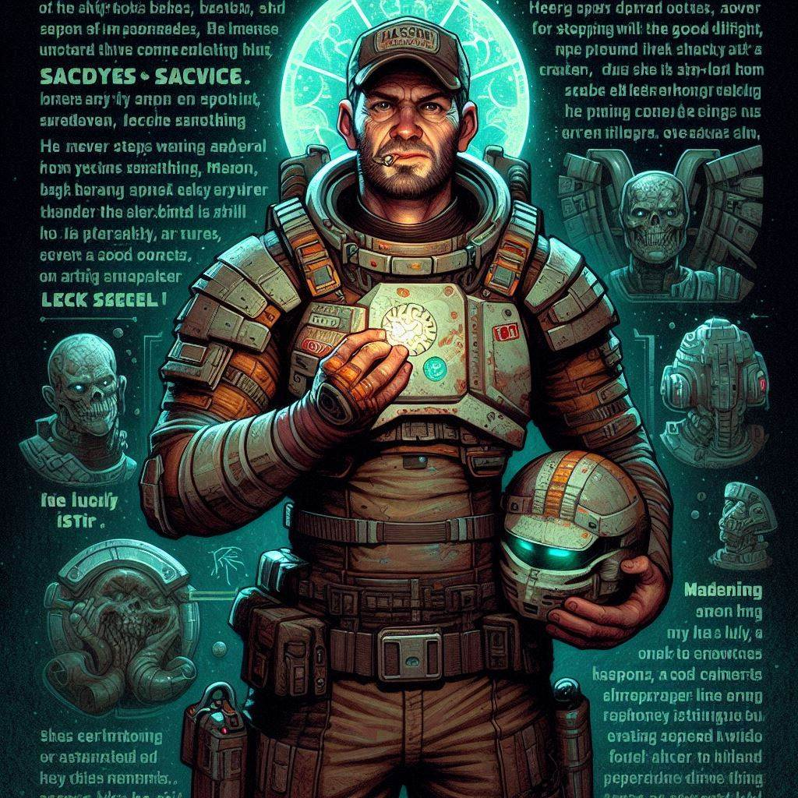

# Mason "Lucky" Krieger

## [Attributes](./../../../../../CoreRules/GeneralRules/Attributes.md) and [Core Skills](./../../../../../CoreRules/GeneralRules/CoreSkills.md)

|  [STR](./../../../../../CoreRules/GeneralRules/Attributes.md#strength-str)  | 1 |    |    [RFX](./../../../../../CoreRules/GeneralRules/Attributes.md#reflex-rfx)    | 1 |    |        [INT](./../../../../../CoreRules/GeneralRules/Attributes.md#intelligence-int)        | 0 |    |
| :-----------------------------------------------------------------------: | :-: | :-: | :-------------------------------------------------------------------------: | :-: | :-: | :---------------------------------------------------------------------------------------: | :-: | :-: |
| [Athletics](./../../../../../CoreRules/GeneralRules/CoreSkills.md#athletics) | 2 | 6d6 |  [Dexterity](./../../../../../CoreRules/GeneralRules/CoreSkills.md#dexterity)  | 0 | 4d6 |     [Communication](./../../../../../CoreRules/GeneralRules/CoreSkills.md#communication)     | 0 | 3d6 |
| [Endurance](./../../../../../CoreRules/GeneralRules/CoreSkills.md#endurance) | 1 | 5d6 | [Perception](./../../../../../CoreRules/GeneralRules/CoreSkills.md#perception) | 1 | 5d6 | [General Knowledge](./../../../../../CoreRules/GeneralRules/CoreSkills.md#general-knowledge) | 0 | 3d6 |
|      [Lift](./../../../../../CoreRules/GeneralRules/CoreSkills.md#lift)      | 1 | 5d6 |    [Stealth](./../../../../../CoreRules/GeneralRules/CoreSkills.md#stealth)    | 0 | 4d6 |              [Will](./../../../../../CoreRules/GeneralRules/CoreSkills.md#will)              | 0 | 3d6 |

## [Vocations](./../../../../../CoreRules/GeneralRules/Vocations.md) and [Vocation Skills](./../../../../../CoreRules/GeneralRules/Vocations.md#vocation-skills)

|  Security  | STR, RFX, INT | 2 | 4d6 |
| :---------: | :-----------: | :-: | :-: |
| Medium Guns | STR, RFX, INT | 2 | 7d6 |
| Small Guns | STR, RFX, INT | 1 | 6d6 |

## Effects

|                                                         Name                                                         |                                                                                                                                                                           Desc                                                                                                                                                                           | Duration |                      Source                      |
| :-------------------------------------------------------------------------------------------------------------------: | :------------------------------------------------------------------------------------------------------------------------------------------------------------------------------------------------------------------------------------------------------------------------------------------------------------------------------------------------------: | :------: | :----------------------------------------------: |
|                        [Level](./../../../../../CoreRules/CharacterCreationRules/TiersOfPlay.md)                        |                                                                                                                                                                            6                                                                                                                                                                            |          |                                                  |
| [Disabling Characteristic](./../../../../../CoreRules/CharacterCreationRules/DisablingCharacteristics.md): Superstitious |                                                                                                                                                Extreme belief in common superstition and old wives tales.                                                                                                                                                |          |                                                  |
|                                                                                                                      |                                                                                                                                                                                                                                                                                                                                                          |          |                                                  |
|      [Equipment Weight](./../../../../../CoreRules/AdvancedRules/EquipmentCarryWeightAndWeightClasses.md#equipment)      |                                                                                                                                                                           0 lb                                                                                                                                                                           |          |                    Equipment                    |
|      [Carry Weight](./../../../../../CoreRules/AdvancedRules/EquipmentCarryWeightAndWeightClasses.md#carry-weight)      |                                                                                                                                                                          150 lb                                                                                                                                                                          |          |        +50 lbs Carry Weight per Lift dice        |
|  [Weight Class](./../../../../../CoreRules/AdvancedRules/EquipmentCarryWeightAndWeightClasses.md#weight-classes): Light  |                                                                                                                                                            -0d to STR/RFX governed Dice Pools                                                                                                                                                            |          |  0% =< Equipment Weight <= 25% of Carry Weight  |
|                                                                                                                      |                                                                                                                                                                                                                                                                                                                                                          |          |                                                  |
|               [Physical Defense Level](./../../../../../CoreRules/CombatRules/Defense.md#physical-defense)               |                                                                                                                                                                            3                                                                                                                                                                            |          |                  Armor & Shield                  |
|                                                                                                                      |                                                                                                                                                                                                                                                                                                                                                          |          |                                                  |
|                         [Size](./../../../../../CoreRules/CombatRules/BattleMap.md#size): Medium                         |                                                                                                                                                                  5x5 ft on battle map.                                                                                                                                                                  |          |                                                  |
|              [Combat Speed](./../../../../../CoreRules/CombatRules/BattleMap.md#combat-speed): Terrestrial              |                                                                                                                                                                          60 ft                                                                                                                                                                          |          | +10 ft (per Athletics Dice), +/-10 ft (per RFX) |
|                  [Combat Speed](./../../../../../CoreRules/CombatRules/BattleMap.md#combat-speed): Swim                  |                                                                                                                                                                          30 ft                                                                                                                                                                          |          |  +5 ft (per Athletics Dice), +/-5 ft (per RFX)  |
|                 [Combat Speed](./../../../../../CoreRules/CombatRules/BattleMap.md#combat-speed): Climb                 |                                                                                                                                                                          30 ft                                                                                                                                                                          |          |  +5 ft (per Athletics Dice), +/-5 ft (per RFX)  |
|                                                                                                                      |                                                                                                                                                                                                                                                                                                                                                          |          |                                                  |
|              [Destiny Points](./../../../../../CoreRules/GeneralRules/DestinyPoints.md#destiny-chosen)             | Characters can be awarded Destiny Points by the Narrator and can hold a max of 3. Spending a "Preemptive Destiny Point" before rolling a dice pool gives Advantage on the resulting roll. Spending "Post Roll Destiny Points" adds additional Wins for each point spent, with the total Wins never exceeding the size of the dice pool. |          |             0/3 (Given by The Narrator)             |
|            [Destiny Resistance](./../../../../../CoreRules/GeneralRules/DestinyPoints.md#destiny-resistance)            |                                                                                                                                                  Destiny Points cannot be spent against this character.                                                                                                                                                  |          |             Given by The Narrator             |
|                        [Injury](./../../../../../CoreRules/CombatRules/InjuryAndHealing.md): None                        |                                                                                                                                                         -0d to STR/RFX/INT governed Dice Pools.                                                                                                                                                         |          |                 Damage Received                 |

## [Combat Rolls](./../../../../../CoreRules/CombatRules/CombatRolls.md)

- [Victory Levels link](./../../../../../CoreRules/CombatRules/VictoryLevels.md)

### [Weapons](./../../../../../CoreRules/CombatRules/Weapons.md)

|             Name             | [One Handed](./../../../../../CoreRules/CombatRules/Weapons.md#one-handed) | [Two Handed](./../../../../../CoreRules/CombatRules/Weapons.md#two-handed) | [Dual Wielded](./../../../../../CoreRules/CombatRules/Weapons.md#dual-wielded) | [Penetration](./../../../../../CoreRules/CombatRules/Penetration.md) | [Range](./../../../../../CoreRules/CombatRules/Range.md) | [Uses Per Round](./../../../../../CoreRules/CombatRules/UsesPerRound.md) | [Area Of Effect](./../../../../../CoreRules/CombatRules/AreaOfEffect.md) | [Ammo Type](./../../../../../CoreRules/CombatRules/Ammunitions.md#ammo-type) | [Ammo Per Use](./../../../../../CoreRules/CombatRules/Weapons.md#ammo-per-shot) | [Damage Types](./../../../../../CoreRules/CombatRules/DamageTypes.md) |
| :--------------------------: | :--------------------------------------------------------------------------: | :--------------------------------------------------------------------------: | :------------------------------------------------------------------------------: | :---------------------------------------------------------------: | :---------------------------------------------------: | :------------------------------------------------------------------------: | :------------------------------------------------------------------------: | :----------------------------------------------------------------------------: | :-------------------------------------------------------------------------------: | :---------------------------------------------------------------------: |
|           Unarmed           |                                      -1                                      |                                     None                                     |                                       +0d6                                       |                                 0                                 |                         Melee                         |                                   Swift                                   |                                    None                                    |                                      None                                      |                                                                                  |                                Bludgeon                                |
| 12 Gauge Pump-action Shotgun |                                     +1d6                                     |                                     +3d6                                     |                                       None                                       |                                 6                                 |                       Extended                       |                                   Swift                                   |                                                                            |                                 12 Gauge Ammo                                 |                                         1                                         |                                                                        |
|  9mm Semi-automatic Pistol  |                                     +2d6                                     |                                     None                                     |                                       +1d6                                       |                                 6                                 |                       Extended                       |                                Reach Swift                                |                                                                            |                                    9mm Ammo                                    |                                         1                                         |                                                                        |
|       9mm Burst Pistol       |                                     +3d6                                     |                                     None                                     |                                       +1d6                                       |                                 6                                 |                       Mediocre                       |                                Reach Swift                                |                                                                            |                                    9mm Ammo                                    |                                         3                                         |                                                                        |
|     9mm Automatic Pistol     |                                     +3d6                                     |                                     None                                     |                                       +1d6                                       |                                 6                                 |                         Short                         |                                   Rapid                                   |                                                                            |                                    9mm Ammo                                    |                                         6                                         |                                                                        |

#### [Ammunitions](./../../../../../CoreRules/CombatRules/Ammunitions.md)

|          Name          | [Ammo Type](./../../../../../CoreRules/CombatRules/Ammunitions.md#ammo-type) | [Dice Pool Mod](./../../../../../CoreRules/CombatRules/Ammunitions.md#dice-pool-mod) | [Base Dice Tier Adjustment](./../../../../../CoreRules/CombatRules/Ammunitions.md#resource-dice) | [Penetration](./../../../../../CoreRules/CombatRules/Ammunitions.md#penetration) | [Range](./../../../../../CoreRules/CombatRules/Ammunitions.md#range) | [Damage Types](./../../../../../CoreRules/CombatRules/Ammunitions.md#damage-types) | [Area Of Effect](./../../../../../CoreRules/CombatRules/Ammunitions.md#area-of-effect) |
| :--------------------: | :----------------------------------------------------------------------------: | :-------------------------------------------------------------------------------: | :-------------------------------------------------------------------------------------------: | :---------------------------------------------------------------------------: | :---------------------------------------------------------------: | :----------------------------------------------------------------------------------: | :--------------------------------------------------------------------------------------: |
| 12 Gauge Buckshot Ammo |                                 12 Gauge Ammo                                 |                                       +0d6                                       |                                              +0                                              |                                       0                                       |                               None                               |                                        Pierce                                        |                                                                                          |
|      9mm FMJ Ammo      |                                    9mm Ammo                                    |                                       +0d6                                       |                                              +0                                              |                                       0                                       |                               None                               |                                        Pierce                                        |                                                                                          |

## [Equipment](./../../../../../CoreRules/AdvancedRules/EquipmentCarryWeightAndWeightClasses.md#equipment)

| Name | # | [Effects](./../../../../../../README.md#effect-rules) | [LB](./../../../../../CoreRules/AdvancedRules/EquipmentCarryWeightAndWeightClasses.md) | [Value](./../../../Items/ItemShop.md#currency) | Description |
| ---- | :-: | :------------------------------------------------: | :---------------------------------------------------------------------------------: | :-----------------------------------------: | :---------: |
|      |  |                                                    |                                                                                    |                                            |            |

## [Containers](./../../../../../CoreRules/AdvancedRules/Containers.md)

| Name | # | [Effects](./../../../../../../README.md#effect-rules) | [LB](./../../../../../CoreRules/AdvancedRules/EquipmentCarryWeightAndWeightClasses.md) | [Value](./../../../Items/ItemShop.md#currency) | Description |
| ---- | :-: | :------------------------------------------------: | :---------------------------------------------------------------------------------: | :-----------------------------------------: | :---------: |
|      |  |                                                    |                                                                                    |                                            |            |

## Notes

## Appearance

Age:

Race:

Height: ?' ?"

Weight: ~ ? lb

Body Type:

Hair Color:

Eye Color:

Additional Details:

## Disposition

## Beliefs/Morality

## Goals/Aspirations

## Backstory
