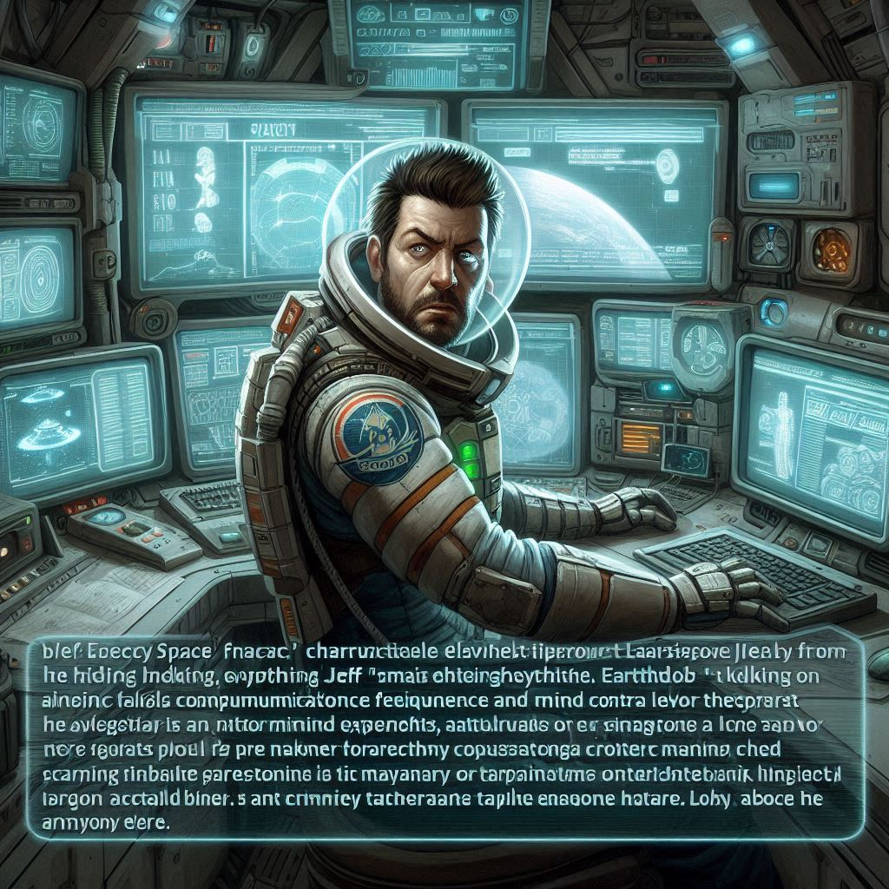

# Jeff "Whispers" Lorne - *The Conspiracy Theorist*

## [Attributes](./../../../../../CoreRules/GeneralRules/Attributes.md) and [Core Skills](./../../../../../CoreRules/GeneralRules/CoreSkills.md)

|  [STR](./../../../../../CoreRules/GeneralRules/Attributes.md#strength-str)  | 0 |    |    [RFX](./../../../../../CoreRules/GeneralRules/Attributes.md#reflex-rfx)    | 0 |    |        [INT](./../../../../../CoreRules/GeneralRules/Attributes.md#intelligence-int)        | 2 |    |
| :-----------------------------------------------------------------------: | :-: | :-: | :-------------------------------------------------------------------------: | :-: | :-: | :---------------------------------------------------------------------------------------: | :-: | :-: |
| [Athletics](./../../../../../CoreRules/GeneralRules/CoreSkills.md#athletics) | 1 | 4d6 |  [Dexterity](./../../../../../CoreRules/GeneralRules/CoreSkills.md#dexterity)  | 2 | 5d6 |     [Communication](./../../../../../CoreRules/GeneralRules/CoreSkills.md#communication)     | 0 | 5d6 |
| [Endurance](./../../../../../CoreRules/GeneralRules/CoreSkills.md#endurance) | 1 | 4d6 | [Perception](./../../../../../CoreRules/GeneralRules/CoreSkills.md#perception) | 2 | 5d6 | [General Knowledge](./../../../../../CoreRules/GeneralRules/CoreSkills.md#general-knowledge) | 2 | 7d6 |
|      [Lift](./../../../../../CoreRules/GeneralRules/CoreSkills.md#lift)      | 0 | 3d6 |    [Stealth](./../../../../../CoreRules/GeneralRules/CoreSkills.md#stealth)    | 2 | 5d6 |              [Will](./../../../../../CoreRules/GeneralRules/CoreSkills.md#will)              | 0 | 5d6 |

## [Vocations](./../../../../../CoreRules/GeneralRules/Vocations.md) and [Vocation Skills](./../../../../../CoreRules/GeneralRules/Vocations.md#vocation-skills)

| Engineer |   RFX, INT   | 2 | 7d6 |
| :-------: | :-----------: | :-: | :-: |
| Small Gun | STR, RFX, INT | 2 | 7d6 |
|  Repair  | STR, RFX, INT |  | 3d6 |

## Effects

|                                                            Name                                                            |                                                                                                                                                                           Desc                                                                                                                                                                           | Duration |                      Source                      |
| :------------------------------------------------------------------------------------------------------------------------: | :------------------------------------------------------------------------------------------------------------------------------------------------------------------------------------------------------------------------------------------------------------------------------------------------------------------------------------------------------: | :------: | :----------------------------------------------: |
|                           [Level](./../../../../../CoreRules/CharacterCreationRules/TiersOfPlay.md)                           |                                                                                                                                                                            6                                                                                                                                                                            |          |                                                  |
| [Disabling Characteristic](./../../../../../CoreRules/CharacterCreationRules/DisablingCharacteristics.md): Goverment Paranioa |                                                                                                                                               Extreme belief that the ruling class is run by an evil cult.                                                                                                                                               |          |                                                  |
|                                                                                                                            |                                                                                                                                                                                                                                                                                                                                                          |          |                                                  |
|        [Equipment Weight](./../../../../../CoreRules/AdvancedRules/EquipmentCarryWeightAndWeightClasses.md#equipment)        |                                                                                                                                                                          0 lb                                                                                                                                                                          |          |                    Equipment                    |
|         [Carry Weight](./../../../../../CoreRules/AdvancedRules/EquipmentCarryWeightAndWeightClasses.md#carry-weight)         |                                                                                                                                                                          150 lb                                                                                                                                                                          |          |        +50 lbs Carry Weight per Lift dice        |
|    [Weight Class](./../../../../../CoreRules/AdvancedRules/EquipmentCarryWeightAndWeightClasses.md#weight-classes): Light    |                                                                                                                                                            -0d to STR/RFX governed Dice Pools                                                                                                                                                            |          |  0% =< Equipment Weight <= 25% of Carry Weight  |
|                                                                                                                            |                                                                                                                                                                                                                                                                                                                                                          |          |                                                  |
|               [Minor Weakness](./../../../../../CoreRules/CombatRules/WeaknessAndResistance.md): (damage type)               |                                                                                                                                                   +1 to the level of injury received from damage type.                                                                                                                                                   |          |                                                  |
|                 [Physical Defense Level](./../../../../../CoreRules/CombatRules/Defense.md#physical-defense)                 |                                                                                                                                                                            2                                                                                                                                                                            |          |                  Armor & Shield                  |
|                                                                                                                            |                                                                                                                                                                                                                                                                                                                                                          |          |                                                  |
|                           [Size](./../../../../../CoreRules/CombatRules/BattleMap.md#size): Medium                           |                                                                                                                                                                  5x5 ft on battle map.                                                                                                                                                                  |          |                                                  |
|                 [Combat Speed](./../../../../../CoreRules/CombatRules/BattleMap.md#combat-speed): Terrestrial                 |                                                                                                                                                                          30 ft                                                                                                                                                                          |          | +10 ft (per Athletics Dice), +/-10 ft (per RFX) |
|                    [Combat Speed](./../../../../../CoreRules/CombatRules/BattleMap.md#combat-speed): Swim                    |                                                                                                                                                                          15 ft                                                                                                                                                                          |          |  +5 ft (per Athletics Dice), +/-5 ft (per RFX)  |
|                    [Combat Speed](./../../../../../CoreRules/CombatRules/BattleMap.md#combat-speed): Climb                    |                                                                                                                                                                          15 ft                                                                                                                                                                          |          |  +5 ft (per Athletics Dice), +/-5 ft (per RFX)  |
|                                                                                                                            |                                                                                                                                                                                                                                                                                                                                                          |          |                                                  |
|                           [Magic Resource](./../../../../../CoreRules/MagicRules/MagicResource.md):                           |                                                                                                                                                                           5/5                                                                                                                                                                           |          |       Vocation/Magic Governing Core Skill       |
|                [Destiny Points](./../../../../../CoreRules/GeneralRules/DestinyPoints.md#destiny-chosen)               | Characters can be awarded Destiny Points by the Narrator and can hold a max of 3. Spending a "Preemptive Destiny Point" before rolling a dice pool gives Advantage on the resulting roll. Spending "Post Roll Destiny Points" adds additional Wins for each point spent, with the total Wins never exceeding the size of the dice pool. |          |             0/3 (Given by The Narrator)             |
|               [Destiny Resistance](./../../../../../CoreRules/GeneralRules/DestinyPoints.md#destiny-resistance)               |                                                                                                                                                  Destiny Points cannot be spent against this character.                                                                                                                                                  |          |             Given by The Narrator             |
|                          [Injury](./../../../../../CoreRules/CombatRules/InjuryAndHealing.md): None                          |                                                                                                                                                         -0d to STR/RFX/INT governed Dice Pools.                                                                                                                                                         |          |                 Damage Received                 |

## [Combat Rolls](./../../../../../CoreRules/CombatRules/CombatRolls.md)

- [Victory Levels link](./../../../../../CoreRules/CombatRules/VictoryLevels.md)

### [Weapons](./../../../../../CoreRules/CombatRules/Weapons.md)

|         Name         | [One Handed](./../../../../../CoreRules/CombatRules/Weapons.md#one-handed) | [Two Handed](./../../../../../CoreRules/CombatRules/Weapons.md#two-handed) | [Dual Wielded](./../../../../../CoreRules/CombatRules/Weapons.md#dual-wielded) | [Penetration](./../../../../../CoreRules/CombatRules/Penetration.md) | [Range](./../../../../../CoreRules/CombatRules/Range.md) | [Uses Per Round](./../../../../../CoreRules/CombatRules/UsesPerRound.md) | [Area Of Effect](./../../../../../CoreRules/CombatRules/AreaOfEffect.md) | [Ammo Type](./../../../../../CoreRules/CombatRules/Ammunitions.md#ammo-type) | [Ammo Per Use](./../../../../../CoreRules/CombatRules/Weapons.md#ammo-per-shot) | [Damage Types](./../../../../../CoreRules/CombatRules/DamageTypes.md) |
| :------------------: | :--------------------------------------------------------------------------: | :--------------------------------------------------------------------------: | :------------------------------------------------------------------------------: | :---------------------------------------------------------------: | :---------------------------------------------------: | :------------------------------------------------------------------------: | :------------------------------------------------------------------------: | :----------------------------------------------------------------------------: | :-------------------------------------------------------------------------------: | :---------------------------------------------------------------------: |
|       Unarmed       |                                      -1                                      |                                     None                                     |                                       +0d6                                       |                                 0                                 |                         Melee                         |                                   Swift                                   |                                    None                                    |                                      None                                      |                                                                                  |                                Bludgeon                                |
| Muzzleloading Pistol |                                     +2d6                                     |                                     None                                     |                                       +1d6                                       |                                 4                                 |                       Mediocre                       |                               Extremely Slow                               |                                                                            |                         Muzzleloading Pistol Cartridge                         |                                         1                                         |                                                                        |

#### [Ammunitions](./../../../../../CoreRules/CombatRules/Ammunitions.md)

|                  Name                  | [Ammo Type](./../../../../../CoreRules/CombatRules/Ammunitions.md#ammo-type) | [Dice Pool Mod](./../../../../../CoreRules/CombatRules/Ammunitions.md#dice-pool-mod) | [Base Dice Tier Adjustment](./../../../../../CoreRules/CombatRules/Ammunitions.md#resource-dice) | [Penetration](./../../../../../CoreRules/CombatRules/Ammunitions.md#penetration) | [Range](./../../../../../CoreRules/CombatRules/Ammunitions.md#range) | [Damage Types](./../../../../../CoreRules/CombatRules/Ammunitions.md#damage-types) | [Area Of Effect](./../../../../../CoreRules/CombatRules/Ammunitions.md#area-of-effect) |
| :-------------------------------------: | :----------------------------------------------------------------------------: | :-------------------------------------------------------------------------------: | :-------------------------------------------------------------------------------------------: | :---------------------------------------------------------------------------: | :---------------------------------------------------------------: | :----------------------------------------------------------------------------------: | :--------------------------------------------------------------------------------------: |
| Standard Muzzleloading Pistol Cartridge |                         Muzzleloading Pistol Cartridge                         |                                       +0d6                                       |                                              +0                                              |                                       0                                       |                               None                               |                                        Pierce                                        |                                                                                          |

## [Equipment](./../../../../../CoreRules/AdvancedRules/EquipmentCarryWeightAndWeightClasses.md#equipment)

| Name | # | [Effects](./../../../../../../README.md#effect-rules) | [LB](./../../../../../CoreRules/AdvancedRules/EquipmentCarryWeightAndWeightClasses.md) | [Value](./../../../Items/ItemShop.md#currency) | Description |
| ---- | :-: | :------------------------------------------------: | :---------------------------------------------------------------------------------: | :-----------------------------------------: | :---------: |
|      |  |                                                    |                                                                                    |                                            |            |

## [Containers](./../../../../../CoreRules/AdvancedRules/Containers.md)

| Name | # | [Effects](./../../../../../../README.md#effect-rules) | [LB](./../../../../../CoreRules/AdvancedRules/EquipmentCarryWeightAndWeightClasses.md) | [Value](./../../../Items/ItemShop.md#currency) | Description |
| ---- | :-: | :------------------------------------------------: | :---------------------------------------------------------------------------------: | :-----------------------------------------: | :---------: |
|      |  |                                                    |                                                                                    |                                            |            |

## Notes

## Appearance

Age:

Race:

Height: ?' ?"

Weight: ~ ? lb

Body Type:

Hair Color:

Eye Color:

Additional Details:

## Disposition

## Beliefs/Morality

## Goals/Aspirations

## Backstory

Jeff believes EarthGov is hiding everything—from alien contact to mind control experiments. He spends hours scanning communication frequencies and talking to imaginary informants on his makeshift comms rig. Though his theories are outlandish, he has an uncanny knack for piecing together actual dangers, sometimes before they become apparent to anyone else. His paranoia led him to stash weapons and supplies in obscure parts of the ship, which could come in handy if the crew finds themselves overrun.

On one mission repairing a downed military ship, Jeff salvaged a small tatical nuke which he keeps in a lead lined tool case he never goes anywhere without. He has rigged a detonator, as he refuses to be brainwashed by earthgov.
