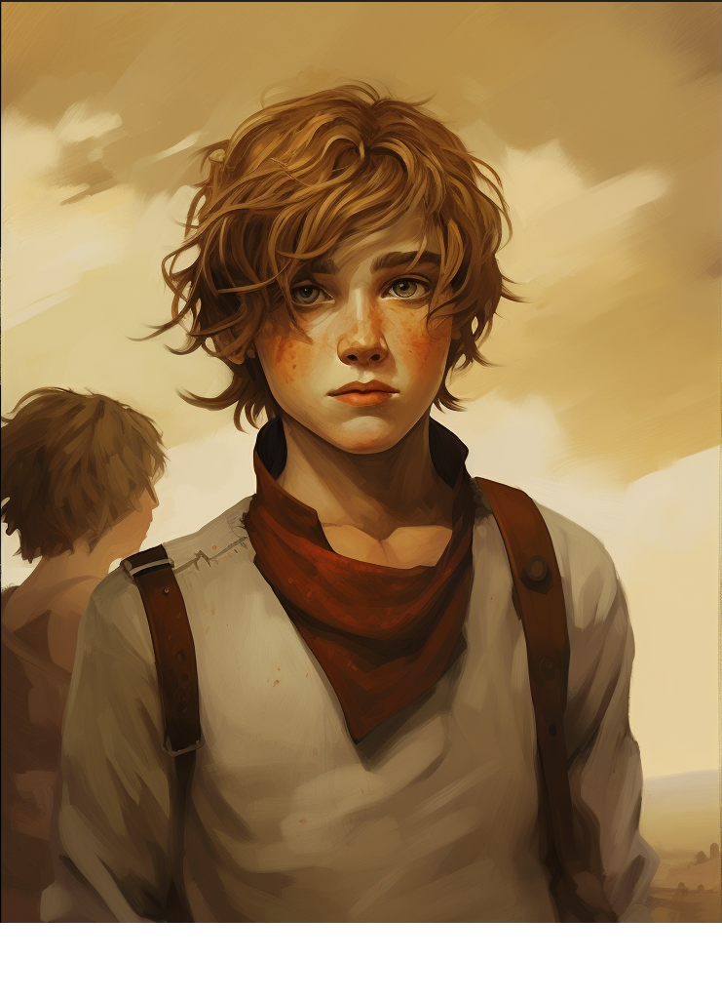

# Killroy Crimson

## Backstory

Killroy arrived in Reddwall along with Vex'halia Reddington after both of them had been stranded on an island at sea that existed on no maps for 4 years. Only having each other to rely upon while stranded, the two formed an unshakable bond. He his utterly in love with Vex'halia. Killroy mysteriously can't remember anything before Vex'halia arriving arriving on the island...

Killroy has had a rough time adapting to city life in Reddwall. Lady and Lord Reddington, grateful to Killroy for saving their daughters life, adopted him as their personal ward, tutoring him in reading, writing, swordsmanship, etc... Killroy became friends with Luc Lightbringer, as both shared a passion for swordsmanship, philosophy, books, and engineering. While Luc looks down on Crossbreed in general, he respects Killroy's shear determination.

When Killroy was 15, Vex'halia and Luc snuck out of Reddwall to enjoy the summer heat and go swimming a secret pond that Luc had heard about. While Vex'halia and Luc had planned to go alone, once Killroy got wind he insisted he come. Vex'halia, terrified of any water she couldn't stand in, eventually told Killroy he could come. Upon arriving at the secluded pond outside of Reddwall, the 3 went swimming, with Vex staying in the shallow end. Luc swam to the middle, playfully taunting Vex, before being dragged beneath the waves by a trench lurker, a monster known to carry shard's disease. Fearing for Luc's life, Vex asked Killroy to swim out and help Luc. While he was successful as rescuing Luc, Killroy was caught instead, being dragged to the bottom of the pond by the monster.

Flint Reddington, had caught wind that Vex and Luc where planning to sneak out decided to tail the trio that day. Bored by his lordly duties, Flint with rum in hand jumped at the opportunity to sneakily tail the trio on a beautiful summer day, reminding of his youthful days of adventure. Ensuring there would be no funny business, Flint set up for a nap with a clear sight of the pond. Upon awaking to the screaming of his daughter, Flint jumped into action. An expert swimmer and no stranger to fighting underwater monsters, Flint slew the trench lurker. He dragged the shredded body of Killroy to the surface, dumping every vial of healing blood on hand into him before racing towards Reddwall.

Killroy died more than once on the operating table, with only the masterful skill of Lady Reddington keeping him through. While he was saved from certain death, his fate was now far worse as he was infected with shard's disease. Despite his debilitating disease and short outlook on life, Killroy is remarkably positive. Vex grew distant after the incident, blaming herself for causing Killroy's ill fate.

Killroy, knowing his time would be limited in the land of the living, decided to pursue his passion of inventing. With assistance from Flint, Killroy purchased a small warehouse. Naming his business "The Weeping Anvil", Killroy now occupies himself with inventing as the infection slowly spreads through his body.

## Appearance

Age: 16

Race: Crossbreed

Height: 5'8"

Body Type: Frail

## Disposition

- Positive
- Curious
- Love-struck

## Goals/Aspirations

- To protect and help Vex'halia Reddington any way he can.
- To start his own business and become wealthy.
