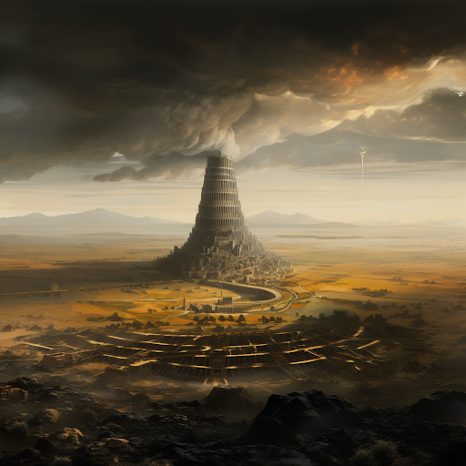

# History

## The Twilight Age

Following the Bright Lord's ascension, commenced the Twilight Age, an era spanning 10,000 years during which Fellkin and Brightkin fought a relentless battle against the monstrous inhabitants of the planet. With sheer determination and the strength of their own blood and steel, the Bright Lord’s creations painstakingly carved out the first civilizations of Terra. These were times of conflict, where kingdoms succumbed to the perils of monsters, diseases, internal strife and each other.

## The Dawn Age

Eventually, the Dawn Empire emerged as the dominant power, with its resplendent capital, Crossroad, standing at the heart of the continent. From this mighty seat of power, they asserted their control, compelling the kingdoms of Terra to bow before them or face their furious wrath.

And so, with the founding of the Dawn Empire, came about the High Age, an epoch characterized by a semblance of peace and prosperity. Under the rule of Brightkin Emperor Commodus Lightbringer, the realm experienced a period of relative tranquility.
