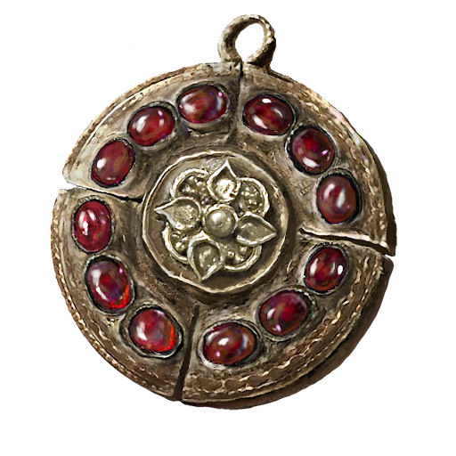

# Crimson Medallion +2

|         Name         | # |         Effects         | LB | Value | Description                                                                                                                                                                                                                      |
| :------------------: | :-: | :---------------------: | :-: | :---: | -------------------------------------------------------------------------------------------------------------------------------------------------------------------------------------------------------------------------------- |
| Crimson Medallion +2 | 1 | Great Enhanced Vitality | 0.2 |   ?   | A medallion with Crimson amber inlaid. A precious talisman for protecting one's life. An essential tool of kings and queens looking for an edge in surviving assassination attempts.  Greatly boosts maximum vitality. |

## Effects

| Name                      |                      Desc                      |    Duration    |        Source        |
| :------------------------ | :--------------------------------------------: | :------------: | :------------------: |
| Greatly Enhanced Vitality | Reduce up to 3d6 of total injury penalty dice. | While equipped | Crimson Medallion +2 |
