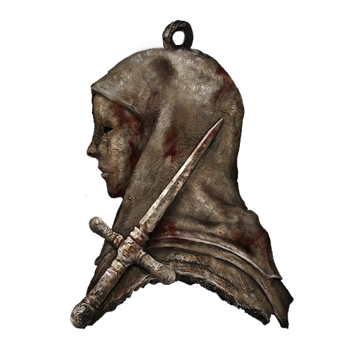

# Dagger Talisman

|      Name      | # |      Effects      | LB | Value | Description                                                                                                                                                                                                                                                                                                                                              |
| :-------------: | :-: | :---------------: | :-: | :---: | -------------------------------------------------------------------------------------------------------------------------------------------------------------------------------------------------------------------------------------------------------------------------------------------------------------------------------------------------------- |
| Dagger Talisman | 1 | Enhanced Critical | 0.2 |   ?   | A talisman depicting a dagger and a surgeon.  Enhances critical hits for sneak attack and incapacitated opponents.  The white-garbed field surgeons come to the aid of friend and foe alike by dealing a final deadly thrust to spare them from the prolonged agony of a mortal wound. A sense of mercy is a catalyst for bloodlust. |

## Effects

| Name              |                              Desc                              |    Duration    |     Source     |
| :---------------- | :------------------------------------------------------------: | :------------: | :-------------: |
| Enhanced Critical | +1 automatic win to sneak attacks and incapacitated opponents. | While equipped | Dagger Talisman |
